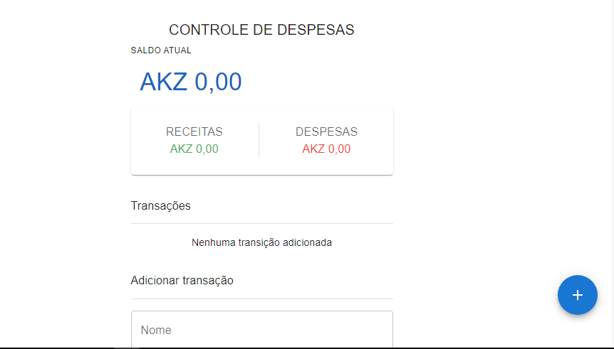
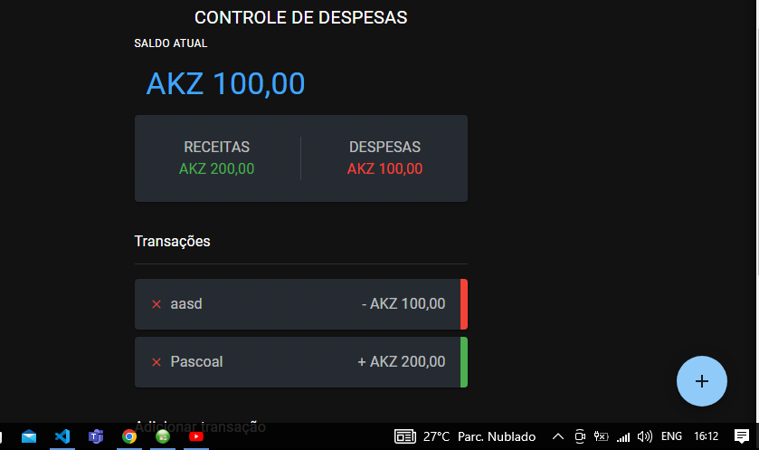

# Gestor Financeiro

Este `projeto` foi desenvolvido com `TypeScript` e `React` com o objetivo de melhorar ainda mas as minhas habilidades em `TypeScript` e `React`. É basicamente uma `aplicação` web para ajudar as `empresas` para terem acesso ao controlo das suas `receitas` e `despesas` de uma forma simples.

A aplicação têm três partes principais o `Saldo atual` que é a diferença entre as receitas e despesas, as `Receitas` que é o `saldo positivo` e as `Despesas` que é o `saldo negativo` todos estes `valores`
dependem das `Transações` que são adicionadas e excluidas pelo `usuário`.

## Tecnologias

As seguintes ferramentas foram usadas na constuição deste projeto:

- HTML
- MUI
- TYPESCRIPT
- REACT

#

Feito por Pascoal Kahamba meu [Linkedin](https://https://www.linkedin.com/in/pascoal-kahamba-7b43bb233?lipi=urn%3Ali%3Apage%3Ad_flagship3_profile_view_base_contact_details%3BTg8LEKayToyytOX1pVAQ%2Bg%3D%3D)

[👉Clique aqui para rodar o projeto👈](https://financial-manager-lemon.vercel.app/)😎
